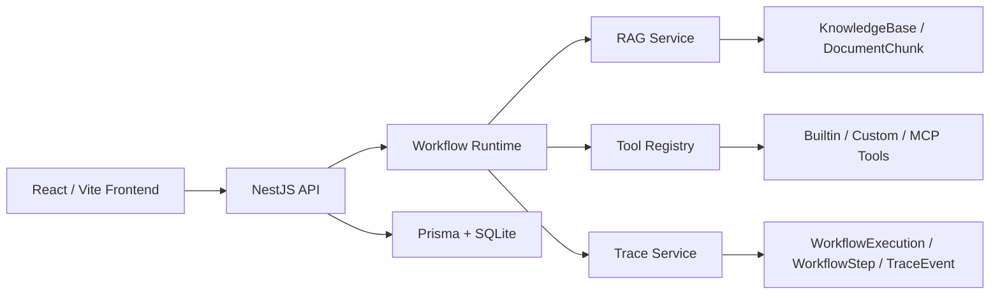
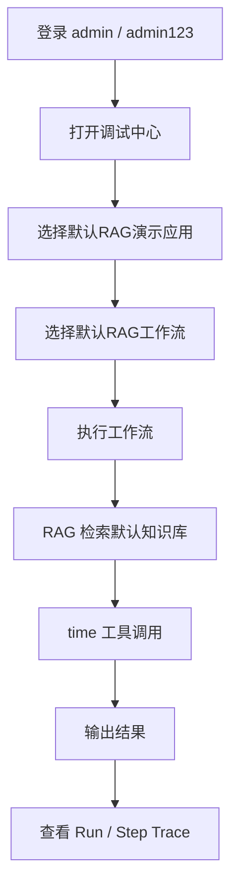

# AgentOps Workbench

AgentOps Workbench 是一个面向 AI Agent 应用开发的可视化工作流编排与调试平台。它把 React Flow 工作流画布、RAG 知识库、Schema-based Tool Registry、Run / Step Trace 和 SSE 事件流串成一条可运行、可观测、可复盘的 Agent demo。

## Demo 看点

- 可视化编排：用 React Flow 配置开始、RAG、工具、条件分支、LLM、输出等节点。
- Run / Step Trace：每次运行都会持久化 Run、Step、TraceEvent，并在调试中心显示时间线。
- RAG 证据链：支持文档上传、切片、embedding、TopK 召回、相似度分数和失败 diagnostics。
- Tool Registry：统一内置工具、自定义 HTTP 工具、MCP 示例工具的元信息、Zod 校验和调用结果。
- 权限边界：JWT 登录，工作流运行、RAG retrieve、自定义工具执行都带 owner 校验。
- 默认演示：seed 后自带「默认RAG演示应用」，执行后能同时看到 RAG 召回和工具调用 Trace。

## 架构总览



## 默认demo链路



## 技术栈

前端：

- React 18 + Vite
- React Router v6
- Zustand
- Ant Design
- React Flow
- Axios
- eventsource-parser

后端：

- NestJS
- Prisma ORM
- SQLite
- JWT + Passport
- class-validator / class-transformer
- Zod
- Qwen-compatible Chat / Embedding API
- Server-Sent Events

## 目录结构

```text
.
├── agentops-studio-frontend
│   ├── src/components          # 布局组件、工作流画布和节点组件
│   ├── src/pages               # 工作台、编辑器、知识库、工具、调试页面
│   ├── src/router              # 路由和鉴权守卫
│   ├── src/store               # Zustand store slices
│   └── src/types               # 前端类型定义
├── agentops-studio-backend
│   ├── prisma                  # Prisma schema、seed
│   └── src
│       ├── common              # Guard、decorator、filter、interceptor、Prisma service
│       ├── config              # 环境配置
│       └── modules             # user、app、workflow、rag、skill、tool-registry、mcp、ai
```

## 快速开始

### 环境要求

- Node.js 18+
- npm 9+

### 1. 启动后端

```bash
cd agentops-studio-backend
npm install
cp .env.example .env
npx prisma db push
npx prisma db seed
npm run start:dev
```

后端默认运行在：

```text
http://localhost:3000
```

`.env` 关键配置：

```env
PORT=3000
DATABASE_URL="file:./dev.db"
JWT_SECRET=your-secret-key-here
JWT_EXPIRES_IN=7d
QWEN_API_KEY=your-qwen-api-key-here
QWEN_BASE_URL=https://dashscope.aliyuncs.com/compatible-mode/v1
```

没有配置可用的 `QWEN_API_KEY` 时，RAG 会使用本地 deterministic embedding 兜底，默认 demo 仍可召回默认文档片段。

### 2. 启动前端

```bash
cd agentops-studio-frontend
npm install
npm run dev
```

前端默认运行在：

```text
http://localhost:5173
```

Vite 会把 `/api` 代理到：

```text
http://localhost:3000
```

## 默认数据

执行 `npx prisma db seed` 后会写入：

- 默认用户：`admin / admin123`
- 默认知识库：`默认知识库`
- 默认文档：`AgentOps Studio 功能介绍.md`
- 默认应用：`默认RAG演示应用`
- 默认工作流：开始 -> RAG 检索 -> 时间工具 -> 输出

## 验证路径

### 页面方式

1. 打开 `http://localhost:5173`。
2. 使用 `admin / admin123` 登录。
3. 进入「知识库」，确认存在「默认知识库」和默认文档。
4. 进入「调试中心」。
5. 切到「工作流执行」。
6. 选择「默认RAG演示应用」和「默认RAG工作流」。
7. 点击「执行工作流」。
8. 查看 Run / Step Trace，其中应该出现：
   - `RAG 召回`
   - `工具调用`
   - `Step 结束`
   - `Run 结束`

### API 方式

```bash
# 登录获取 token
TOKEN=$(curl -s -X POST http://localhost:3000/api/users/login \
  -H 'Content-Type: application/json' \
  -d '{"username":"admin","password":"admin123"}' \
  | node -e "let s='';process.stdin.on('data',d=>s+=d);process.stdin.on('end',()=>console.log(JSON.parse(s).data.token))")

# 获取知识库
curl -s http://localhost:3000/api/rag/knowledge-bases \
  -H "Authorization: Bearer $TOKEN"

# RAG 检索
curl -s -X POST http://localhost:3000/api/rag/retrieve \
  -H 'Content-Type: application/json' \
  -H "Authorization: Bearer $TOKEN" \
  -d '{"query":"AgentOps Studio 有什么核心特性？","knowledgeBaseId":"KB_ID","topK":3,"similarityThreshold":0.1}'
```

## 常用脚本

后端：

```bash
cd agentops-studio-backend
npm run build
npm run start:dev
npx prisma validate
npx prisma db push
npx prisma db seed
```

前端：

```bash
cd agentops-studio-frontend
npm run dev
npm run build
npm run preview
```

## 当前边界

- RAG 当前主要处理文本类上传内容，向量存储使用 JSON 字符串落库。
- Tool Registry 已统一内置工具、自定义 HTTP 工具和 MCP 示例工具，但尚未接入外部 MCP server。
- 工作流 LLM 节点还没有 token 级 Trace。
- Trace 已支持持久化和历史查看，但还没有复杂筛选、对比和 replay。
- 前端构建可能出现 chunk size warning，不影响功能运行。
